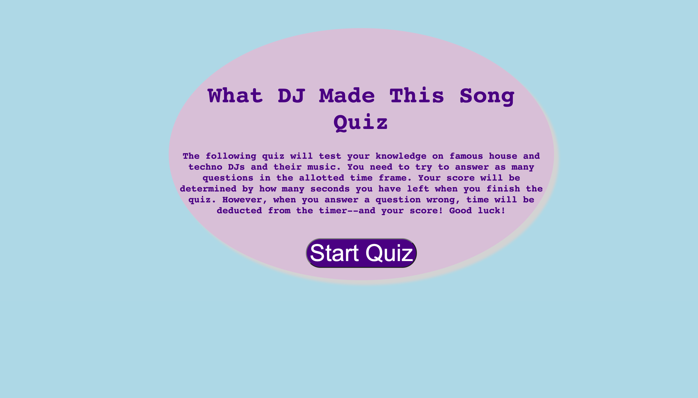
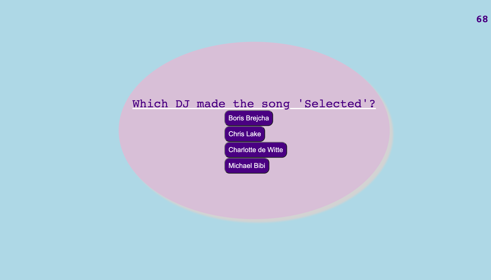
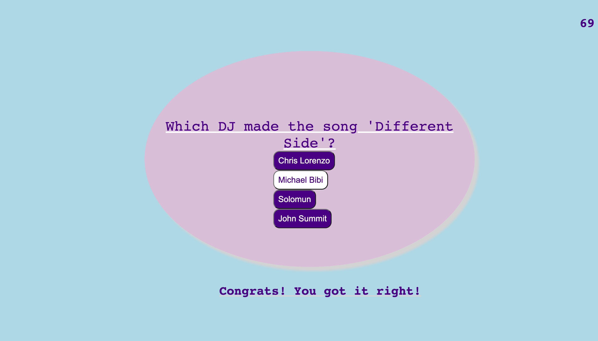
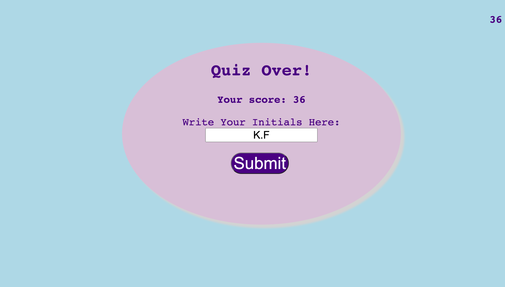
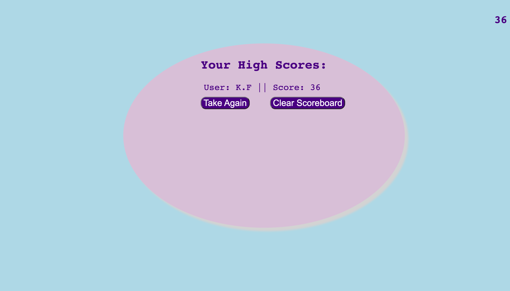

# what-DJ-made-this-song-quiz

## Description

My motivation behind building this project was to create a timed quiz app that featured HTML, CSS, and Javascript languages. I wanted to build a quiz that featured dynamic elements and styling in JS, as well as locally stored a user's scores each time they completed the quiz. My quiz app tests the user's knowledge on famous house and techno DJs as well as their songs, providing an entertaining and interactive way for the user to see if they can match the correct DJ to the song in question. This quiz is made for those who are fans of the house/techno genres, and creates a platform for individuals to both see how exentsive their genre knowledge is, and to perhaps learn about new songs or artists. This app solves the personal problem of creating a website from scratch, for the first time, that uses HTML, CSS, and JavaScript. I was able to work through various bugs to learn how to effectively use JS logic to formulate functional data types, click events, for loops, functions and more in order to create the site. I learned how to utilize the multiple aspects of JS present in my code, as well as local storage in order to save scores. Finally, I was able to add elements such as the setInterval() function to properly time my quiz as the user takes it. Overall, by creating a quiz app that focuses on these music genres, I learned how to make a functional project utilizing the above three languages.


## Usage

The below images show how the quiz can be used. Upon loading the page, the user will be met by the starter page. When they click the 'Start Quiz' button, they will be brought to the first question and the timer will begin counting down from 75s as seen in the second photo. Upon clicking one of the answers, they will be brought to the next question set and will be notified below the question if their previous answer was correct or not, as seen in photo three. Photo three also displays the hover styling for each answer option, which renders the answer button white upon hovering on that option. If the user chooses the wrong answer, they will be notified and the time they have left to complete the quiz will drop by 10s. Upon completing each question, the user will be brought to the submit score page as seen in the fourth photo. The final score of the user is equivalent to the time they finished answering the question set, and this score displayed on the screen. They must enter their initials in the box provided, then upon hitting the submit button they will be brought to the high scores page as seen in the fifth photo. This page locally stores the high scores of the individual user in their browser. Here, the user will have the option to either take the quiz again, clear the scoreboard, or choose both. If they click 'Take Again', they will be brought back to the starter page and will continue through the quiz. Upon answering the questions and entering their initials, they will see their new score logged under their previous score on screen. However, if they click 'Clear Scoreboard', the locally stored scores will be cleared (as well as the high score values on screen). Upon clicking the 'Clear Scoreboard' button, they can either exit the quiz or click 'Take Again' to restart the quiz with all scores cleared. Here is the link to my deployed site: https://kendrafitzgerald.github.io/what-DJ-made-this-song-quiz/ 
    ```
     
      
    


## How to Contribute

If you would like to contribute, please reach out to me via my email, kendrajfitzgerald@gmail.com. I would love any collaboration on how to improve my project.
